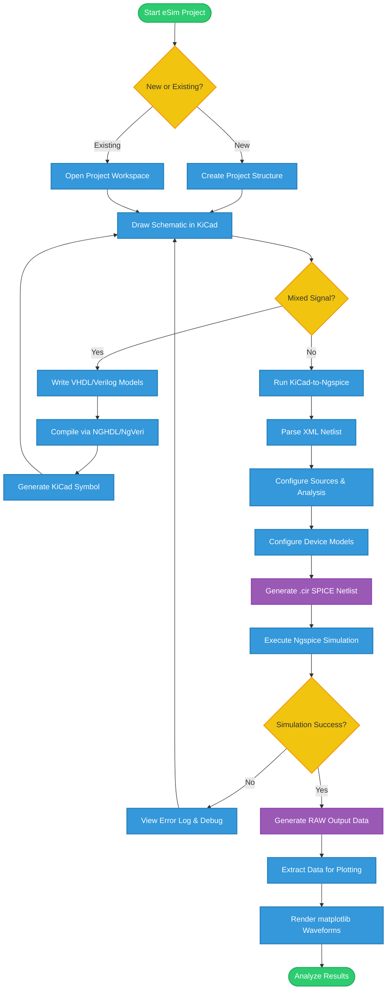
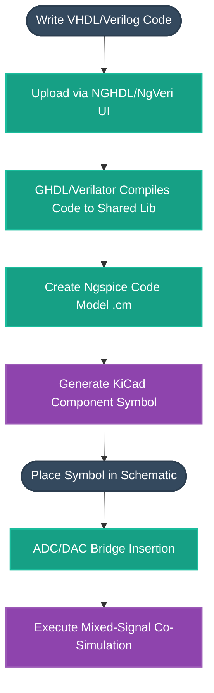
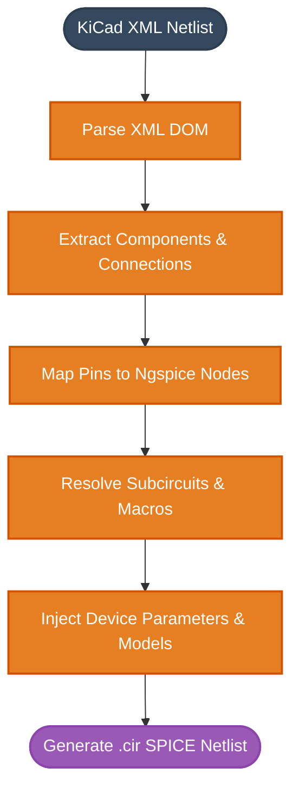

# eSim Architecture & Workflows

This document contains detailed flowcharts and diagrams mapping out the inner workings, simulation pipelines, and data transformations within eSim.

---

## 1. Standard Simulation Workflow

This flowchart details the end-to-end user journey for a standard analog/digital simulation in eSim, from project creation to waveform analysis.

---

## 2. Mixed-Signal Simulation Flow (NGHDL)

This diagram breaks down how eSim bridges digital logic (VHDL/Verilog) with analog simulation using GHDL and Ngspice code models.

---

## 3. KiCad-to-Ngspice Netlist Conversion

A deep dive into the `Convert.py` backend pipeline, showing how KiCad's XML data is processed into an executable SPICE netlist.

---

## 4. Device Model Generation Pipeline

Outlining how user-defined models (Diodes, BJTs, MOSFETs) are integrated via the Model Editor.

---

## 5. Further reading

- [`docs/NGVERI_ACCURACY.md`](docs/NGVERI_ACCURACY.md) — correctness record for
  the NgVeri / NGHDL / d_cosim digital co-simulation backends: what the
  generated `cfunc.mod` contract with ngspice is, the silent-wrong-value
  defects that have been fixed in it, and the open work (notably
  `cm_irreversible()` on generated models).
- **Verilog design identity.** A model is named after the **top module in the
  design**, never after the file holding it (`ModelGeneration.resolve_identity`).
  eSim copies the design into its own build tree, so that copy is named for the
  pipeline and the user's file name is irrelevant — which is why there is no
  longer any "file name and module name are not same" refusal to hit. Three
  cases still take the name from the file, deliberately: `.tlv` (sandpiper has
  not run and always emits `module top`), a top module literally called `top`,
  and a source no parser can read. Designs live in
  `<workspace>/VerilogLibrary/<module>/`, written by `DesignBus`'s debounced
  autosave (`maker/verilog_library.py`).
- [`docs/MAKERCHIP_INTEGRATION.md`](docs/MAKERCHIP_INTEGRATION.md) — the
  browser-plugin bridge behind **Edit in Makerchip IDE**, including file sync,
  conflict handling, loopback security and the boundary between Makerchip and
  eSim Verify/Convert.
- [`docs/UPSTREAM_DECISIONS.md`](docs/UPSTREAM_DECISIONS.md) — the defects in
  eSim's core converter and the NgVeri backend that are **measured, fixed, and
  deliberately switched off**, because turning them on would change results
  eSim has produced since 2.5. Read this before wiring any of that code back
  in. The rule it records: the converter and NgVeri behave as 2.5 did, and
  d_cosim matches NgVeri bug-for-bug so that swapping backends never changes a
  number.
