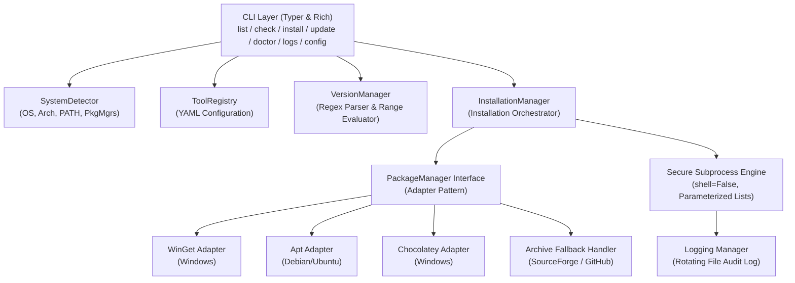

# eSimMate — Automated Tool & Dependency Manager for eSim

[](https://www.python.org/)
[](LICENSE)
[](tests/)
[](https://esim.fossee.in/)
[](https://drive.google.com/file/d/1v5mQ2T5S5EomCeYlOKKxwCgS-CNB4E8n/view?usp=sharing)

> **FOSSEE eSim Semester Long Internship – Autumn 2026**  
> **Screening Task 5: Automated Tool Manager (CSE and related fields)**  
> **Author:** Dharanidharan T. | Sri Eshwar College of Engineering

---

## 📌 Project Overview

**eSimMate** is a Python-based Automated Tool and Dependency Manager engineered specifically for the **eSim** EDA ecosystem. 

eSim integrates multiple external open-source tools and libraries for schematic capture, circuit simulation, digital HDL development, multi-domain modeling, and 3D PCB workflows. Managing these heterogeneous tools manually introduces significant friction due to fragmented installation methods, PATH misconfigurations, breaking version differences, missing runtime dependencies, and platform-specific package-manager availability.

eSimMate provides a centralized, extensible command-line interface (CLI) and diagnostic engine to automate tool detection, verify version compatibility, coordinate safe package installations with dry-run previews, execute official archive fallbacks, and audit system health across cross-platform environments.

```
+-----------------------------------------------------------------------------------------------+
|                                    eSimMate Core Workflow                                     |
|                                                                                               |
|  [ User / CLI ]                                                                               |
|        │                                                                                      |
|        ▼                                                                                      |
|  [ System Detection ] ──► OS, Arch, Package Managers (winget, apt, choco), PATH, Env Vars     |
|        │                                                                                      |
|        ▼                                                                                      |
|  [ Tool Registry ]    ──► Load metadata, executable candidates, version regex (tools.yaml)   |
|        │                                                                                      |
|        ▼                                                                                      |
|  [ Version Manager ]  ──► Query binaries, parse semver, compare compatibility bounds           |
|        │                                                                                      |
|        ▼                                                                                      |
|  [ Installation Mgr]  ──► Strategy Selection: Package Manager Adapter OR Archive Fallback    |
|        │                                                                                      |
|        ▼                                                                                      |
|  [ Safe Execution ]   ──► User confirmation, dry-run mode, parameterized subprocesses, logs   |
+-----------------------------------------------------------------------------------------------+
```

---

## 🎯 Problem Statement

eSim depends on multiple external tools:
* **KiCad:** Schematic capture and PCB layout design
* **Ngspice:** SPICE circuit simulation engine
* **GHDL:** VHDL hardware description simulation
* **OpenModelica (`omc`):** Equation-based multi-domain modeling
* **Verilator:** Fast cycle-accurate Verilog/SystemVerilog simulator
* **FreeCAD:** 3D mechanical and PCB visualization
* **Python:** Core runtime and scripting environment

### Challenges with Manual Management:
1. **Version Incompatibility & Drift:** Newer or older releases of tools (e.g., major changes in KiCad netlist syntax or Ngspice output formats) break simulation pipelines.
2. **Missing Executables & PATH Conflicts:** Tools installed in custom directories fail to link with eSim due to missing environment variables (`PATH`, `OPENMODELICAHOME`, `KICAD_SYMBOL_DIR`).
3. **Fragmented Package Ecosystems:** Different package managers (`winget`, `apt`, `choco`) host different versions, or fail to package required tools.
4. **Unsafe Privileged Execution:** Manual scripts frequently run arbitrary shell commands (`os.system()` / `shell=True`), risking permission corruption or broken system dependencies.
5. **Difficult Troubleshooting:** Lack of centralized environment diagnostics leaves users unable to isolate why simulations fail.

---

## 🎯 Objectives

* **Automated Tool Detection:** Instantly scan system `$PATH`, custom installation paths, and platform-specific directories for registered EDA binaries.
* **Semantic Version Extraction & Validation:** Safely execute version query flags (`--version`, `-v`) and validate discovered versions against configured compatibility ranges (Minimum, Recommended, Maximum).
* **Automated & Polymorphic Tool Installation:** Abstract package managers (`winget`, `apt`, `choco`) behind an extensible Adapter pattern.
* **Official Archive Fallback Strategy:** Automatically download, extract, and configure standalone vendor archives when package managers lack current packages (demonstrated for Ngspice on Windows).
* **Safe Dry-Run Previews:** Provide a non-destructive simulation mode (`--dry-run`) displaying the exact command sequence and target paths before execution.
* **System Doctor Diagnostics:** 5-stage health check inspecting OS, hardware architecture, package managers, tool statuses, and environment variables.
* **Structured Audit Logging:** Maintain persistent rotating log files recording all actions, CLI invocations, and error traces.

---

## ✨ Key Features

### 1. Automated Tool Detection
eSimMate searches for registered tool executables across:
- Active System `PATH`
- Configured application directories (e.g., `Program Files`, `/usr/bin`, `/usr/local/bin`)
- Platform-specific executable name candidates (e.g., `ngspice.exe`, `spice64.exe`, `ngspice`)
- Managed extraction directories

Tools are classified into distinct states: `INSTALLED`, `NOT_INSTALLED`, or `VERSION_UNKNOWN`.

### 2. Version Management & Comparison
After detecting an executable binary, eSimMate safely executes the configured version command and extracts the semantic version using regular expressions. The detected version is evaluated against target version constraints:

$$\text{Min Version} \le \text{Detected Version} \le \text{Max Version}$$

**Example:**
* **Tool:** Ngspice Circuit Simulator
* **Minimum Version:** `34.0.0`
* **Recommended Version:** `38.0.0`
* **Maximum Version:** `46.0.0`
* **Detected Version:** `46.0.0`
* **Status:** `COMPATIBLE`

### 3. Compatibility Classification Matrix
| Status Badge | Description | Action Required |
| :--- | :--- | :--- |
| **`COMPATIBLE`** | Version falls within the verified eSim operational range | None (Ready for simulation) |
| **`OUTDATED`** | Version is below the minimum required threshold | Upgrade recommended |
| **`NEWER_VERSION`** | Version exceeds the verified maximum threshold | Caution: May have unverified breaking changes |
| **`NOT_INSTALLED`** | Executable binary was not found on system paths | Installation required |
| **`VERSION_UNKNOWN`** | Executable found, but version output could not be parsed | Review binary or regex configuration |
| **`ERROR`** | Execution failed during detection or query | Inspect permissions / logs |

### 4. Automated Installation Management
The installation engine coordinates multi-step installations with built-in safety controls:
```
Installation Request
  └── Platform & Architecture Detection
        └── Package Manager Detection (WinGet / Apt / Choco)
              └── Package Availability Verification
                    └── Strategy Selection (Package Manager vs. Archive Fallback)
                          └── Interactive User Confirmation (unless --yes)
                                └── Subprocess Execution (shell=False)
                                      └── Post-Installation Verification & Audit Logging
```

### 5. Package Manager Adapters
eSimMate uses a clean Adapter design pattern (`PackageManagerAdapter` base class) supporting:
* **WinGet Adapter:** Native Windows Package Manager (`winget install --id <ID> -e`)
* **Apt Adapter:** Debian/Ubuntu Advanced Package Tool (`sudo apt-get install -y <pkg>`)
* **Chocolatey Adapter:** Windows Chocolatey package manager (`choco install <pkg> -y`)

### 6. Official Archive Fallback
When a package is unavailable or outdated in the system package repository, eSimMate seamlessly falls back to official vendor archives:
- Downloads verified distribution archives (e.g., SourceForge 7z archive for Ngspice)
- Extracts to managed directory structure
- Discovers and links executables
- Verifies post-install version and updates environment configuration

### 7. Safe Dry-Run Mode
Execute any installation with the `--dry-run` flag to preview proposed system modifications without making any changes:
```bash
python -m esimmate.cli install ngspice --dry-run
```
Displays:
* Target tool metadata
* Selected installation strategy (Package Manager vs Archive)
* Exact shell command list to be executed
* Target installation directory and archive URL (if applicable)

### 8. 5-Stage System Doctor (`esimmate doctor`)
A unified diagnostics command that audits:
1. **Host Environment:** OS, release, kernel, architecture (`x86_64`, `arm64`), and Python runtime version.
2. **Package Manager Availability:** Discovers and validates installed CLI package managers.
3. **External Tools Diagnostic:** Scans all registered EDA tools, executable paths, and versions.
4. **Environment Variables:** Checks required eSim environment variables (`KICAD_SYMBOL_DIR`, `OPENMODELICAHOME`, etc.).
5. **Actionable Recommendations:** Outputs clear steps to resolve missing or incompatible tools.

---

## 🏗️ System Architecture



### Core Components & Responsibilities
| Component | Module | Responsibility |
| :--- | :--- | :--- |
| **CLI** | `src/esimmate/cli.py` | Typer command routing, Rich terminal formatting, JSON output, interactive prompts |
| **SystemDetector** | `src/esimmate/detector.py` | Platform identification, CPU architecture, environment variables, `$PATH` search |
| **ToolRegistry** | `src/esimmate/registry.py` | Loads tool metadata, executable candidates, and fallback recipes from `configs/tools.yaml` |
| **VersionManager** | `src/esimmate/version_manager.py` | Executes version queries, extracts semver strings, evaluates compatibility bounds |
| **InstallationManager** | `src/esimmate/installer.py` | Orchestrates strategy selection, user confirmations, dry-run simulation, and verification |
| **PackageManager** | `src/esimmate/package_manager.py` | Polymorphic adapters (`AptAdapter`, `WingetAdapter`, `ChocolateyAdapter`) |
| **Logger** | `src/esimmate/logger.py` | Structured rotating file logger (`logs/esimmate.log`) and audit tracking |
| **Configuration** | `src/esimmate/config.py` | Centralized settings management (`configs/config.yaml`) |

---

## 📁 Project Structure

```text
eSimMate/
├── .gitignore
├── AGENTS.md                          # Development instructions & guidelines
├── LICENSE                            # BSD-3-Clause Open Source License
├── pyproject.toml                     # Package specification & build configuration
├── README.md                          # Comprehensive project documentation
├── configs/
│   ├── config.yaml                    # Global application configuration
│   └── tools.yaml                     # Registered EDA tools metadata & version ranges
├── docs/
│   ├── architecture.md                # System architectural design & UML diagrams
│   ├── dependency-analysis.md         # EDA tool dependency requirements analysis
│   ├── design_document.md             # Detailed technical design specifications
│   ├── fossee-compliance-matrix.md    # Screening task requirement mapping
│   ├── implementation-audit.md        # Technical verification & audit trail
│   ├── presentation_script.md         # Demonstration video walkthrough script
│   └── requirements.md                # Functional & non-functional requirements
├── logs/
│   └── esimmate.log                   # Persistent rotating audit logs
├── src/
│   └── esimmate/
│       ├── __init__.py                # Package initialization & exports
│       ├── cli.py                     # Typer CLI entry points & Rich terminal tables
│       ├── compatibility.py           # Compatibility status enumerations & data models
│       ├── config.py                  # PyYAML configuration manager
│       ├── detector.py                # OS, Arch, and binary path detector
│       ├── installer.py               # Installation manager & workflow coordinator
│       ├── logger.py                  # Structured rotating logger
│       ├── package_manager.py         # Polymorphic package manager adapters
│       ├── registry.py                # Tool registry loader & validator
│       ├── tool.py                    # Tool data model & executable candidate definitions
│       └── version_manager.py         # Subprocess version extraction & evaluation
└── tests/
    ├── test_cli.py                    # CLI command invocation & output tests
    ├── test_compatibility.py          # Compatibility status model tests
    ├── test_config.py                 # Configuration loader tests
    ├── test_detector.py               # Platform detection & binary discovery tests
    ├── test_installer.py              # Installation workflow & strategy tests
    ├── test_integration.py           # End-to-end integration workflows
    ├── test_logger.py                 # Audit logging verification tests
    ├── test_package_manager.py        # Package manager adapter unit tests
    ├── test_registry.py               # Tool registry YAML parsing tests
    ├── test_tool.py                   # Tool definition & model tests
    └── test_version_manager.py        # Version regex & range comparison tests
```

---

## 🛠️ Technology Stack

| Layer | Technology | Purpose |
| :--- | :--- | :--- |
| **Core Runtime** | Python 3.10 – 3.12 | Base programming language |
| **CLI Framework** | [Typer](https://typer.tiangolo.com/) | Type-annotated CLI command definitions and options |
| **Terminal UI** | [Rich](https://rich.readthedocs.io/) | Beautiful tables, status badges, progress feedback, and markdown rendering |
| **Configuration** | [PyYAML](https://pyyaml.org/) | Human-readable configuration for tools, version bounds, and adapters |
| **Process Execution** | Python `subprocess` | Secure, parameterized external command execution (`shell=False`) |
| **Testing** | [Pytest](https://docs.pytest.org/) | Unit, integration, and mocking test suite |
| **Version Control** | Git & GitHub | Source code tracking and collaboration |

---

## 🔧 Registered Tools

The tool registry (`configs/tools.yaml`) configures the external toolchain required by eSim:

| Tool ID | Tool Name | Role in eSim | Supported Adapters | Min Version | Recommended | Max Version |
| :--- | :--- | :--- | :--- | :---: | :---: | :---: |
| `kicad` | KiCad EDA | Schematic Capture & PCB Layout | `winget`, `choco`, `apt` | `6.0.0` | `7.0.10` | `8.0.0` |
| `ngspice` | Ngspice Simulator | SPICE Circuit Simulator | `apt`, Archive Fallback (7z) | `34.0.0` | `38.0.0` | `46.0.0` |
| `ghdl` | GHDL VHDL Simulator | VHDL Digital Simulator | `apt` (Linux), Detection (Win) | `2.0.0` | `3.0.0` | `4.1.0` |
| `openmodelica` | OpenModelica (`omc`) | Multi-Domain Modeling Engine | `winget`, `apt` | `1.18.0` | `1.21.0` | `1.24.0` |
| `verilator` | Verilator | Verilog HDL Simulator | `apt` (Linux), Detection (Win) | `4.200` | `5.006` | `5.028` |
| `freecad` | FreeCAD 3D Modeler | 3D Mechanical & PCB Viewer | `winget`, `choco`, `apt` | `0.20.0` | `0.21.2` | `1.0.0` |
| `python` | Python 3 Runtime | Execution Engine | Monitored Prerequisite | `3.10.0` | `3.11.9` | `3.12.9` |

---

## 💻 CLI Usage & Commands

### 1. List Registered Tools
Displays all tools registered in the eSimMate configuration with categories and version bounds.
```bash
python -m esimmate.cli list
```
*(Supports `--json` for machine-readable automation pipelines)*

### 2. Check Tool Compatibility
Scans system paths, identifies installed binaries, executes version queries, and renders the compatibility matrix.
```bash
python -m esimmate.cli check
```
**Sample Output:**
```text
Host Environment: Windows (Windows 10 (build 26200)) | Arch: x86_64 (64-bit) | Python: 3.11.9
Package Managers Detected: winget

                       eSim Tool Compatibility Check Matrix
+-----------------------------------------------------------------------------------------------+
| Tool ID  | Tool Name           | Category      | Installed Ver | Required Range       | Status|
|----------+---------------------+---------------+---------------+----------------------+-------|
| python   | Python 3 Runtime    | runtime       | 3.11.9        | Min:3.10.0|Rec:3.11.9| COMPAT|
| ngspice  | Ngspice Simulator   | simulation    | 46            | Min:34.0.0|Rec:38.0.0| COMPAT|
| kicad    | KiCad EDA           | schematic_pcb | N/A           | Min:6.0.0 |Rec:7.0.10| NOT_IN|
| ghdl     | GHDL VHDL Simulator | hdl           | N/A           | Min:2.0.0 |Rec:3.0.0 | NOT_IN|
+-----------------------------------------------------------------------------------------------+
```

### 3. Dry-Run Installation Preview
Simulate an installation to inspect the execution plan without modifying your system.
```bash
python -m esimmate.cli install ngspice --dry-run
python -m esimmate.cli install kicad --dry-run
```

### 4. Install an External Tool
Installs a specific tool or all missing tools, with mandatory interactive confirmation.
```bash
# Install a specific tool
python -m esimmate.cli install kicad

# Non-interactive installation (auto-confirm)
python -m esimmate.cli install kicad --yes

# Install all missing tools
python -m esimmate.cli install --all
```

### 5. Update Outdated Tools
Detects outdated tools and executes updates for eligible tools:
```bash
python -m esimmate.cli update --dry-run
```

### 6. Run System Doctor Diagnostics
Executes a 5-stage comprehensive diagnostic scan of the host environment:
```bash
python -m esimmate.cli doctor
```

### 7. View Operation Audit Logs
Inspect persistent logs of all detection, verification, and installation operations:
```bash
# View last 20 log entries
python -m esimmate.cli logs

# View last 50 log entries
python -m esimmate.cli logs -n 50
```

---

## 🔐 Security & Safety Controls

eSimMate adheres to strict security principles to safeguard the host operating system:
* **Zero Arbitrary Shell Execution:** Complete prohibition of `os.system()` and `shell=True`.
* **Parameterized Execution:** All commands run via explicit argument lists using `subprocess.run(["command", "arg1", "arg2"], shell=False)`.
* **Explicit User Confirmation:** Privileged installation operations require interactive confirmation unless explicit `--yes` is supplied.
* **Isolated Dry-Run Simulation:** `--dry-run` guarantees zero write operations or system invocations.
* **Non-Destructive Operations:** Never modifies or deletes unrelated system files or existing custom tool installations.
* **Structured Audit Logging:** Every executed command, exit code, and error trace is permanently recorded in `logs/esimmate.log`.

---

## 🧪 Automated Testing

The project includes an extensive automated test suite covering all modules, CLI commands, mock package managers, and end-to-end workflows:

```bash
# Run the complete test suite
python -m pytest -q
```

### Test Suite Execution Result
```text
........................................................................ [ 77%]
.....................                                                    [100%]
93 passed in 16.63s
```

* **Total Tests:** **93 passed** (100% test pass rate)
* **Test Coverage:** Major modules covered including CLI commands, detector, registry, version manager, package manager adapters, installer, and logger.
* **Mock Isolation:** Package-manager installation commands are thoroughly tested with mock subprocesses to ensure safety during automated testing.

---

## 🔬 Target Environment Validation

eSimMate was validated on the following environment:
* **Operating System:** Windows 11 / Windows 10 (x86_64, 64-bit)
* **Python Runtime:** Python 3.11.9
* **Package Manager:** WinGet (Windows Package Manager)

### Ngspice Validation Case Study
The eSimMate detection and compatibility engine verified the managed Ngspice deployment:
* **Tool:** Ngspice Circuit Simulator
* **Installed Version Detected:** `46`
* **Configured Compatibility Range:** `34.0.0 – 46.0.0`
* **Evaluated Status:** `COMPATIBLE`

---

## 🎥 Demonstration Video

A comprehensive demonstration of eSimMate's capabilities is available:

🔗 **[Watch eSimMate – FOSSEE Task 5 Demonstration Video](https://drive.google.com/file/d/1v5mQ2T5S5EomCeYlOKKxwCgS-CNB4E8n/view?usp=sharing)**

### Demonstration Highlights:
1. **Introduction & Architecture Overview:** Modular architecture and separation of concerns.
2. **Tool Detection & Compatibility Matrix:** Real-time scanning and version evaluation.
3. **Dry-Run Installation Previews:** Safe simulation of package manager and fallback strategies.
4. **Package Manager Detection & Strategy Selection:** Dynamic selection between WinGet, Apt, and Archives.
5. **Official Archive Fallback Workflow:** Downloading and configuring verified standalone tool archives.
6. **System Doctor Diagnostics:** 5-stage health check and actionable recommendations.
7. **Ngspice Real-World Validation:** Detection, version extraction, and compatibility verification.
8. **Automated Test Suite Execution:** Running the complete 93-test Pytest suite.

---

## 📦 Installation & Setup

### Prerequisites
* **Python:** 3.10, 3.11, or 3.12
* **Git:** For repository cloning
* **Package Manager:** `winget` / `choco` (Windows) or `apt` (Linux / Ubuntu)

### Step-by-Step Installation

```bash
# 1. Clone the Repository
git clone https://github.com/dharanidh-02/eSimMate.git
cd eSimMate

# 2. Create and Activate a Virtual Environment
# On Windows:
python -m venv .venv
.venv\Scripts\activate

# On Linux / macOS:
python3 -m venv .venv
source .venv/bin/activate

# 3. Install eSimMate in Editable Mode with Dependencies
pip install -e .

# 4. Verify Installation
python -m esimmate.cli list
python -m esimmate.cli check
python -m esimmate.cli doctor

# 5. Run the Automated Tests
python -m pytest -q
```

---

## 📋 FOSSEE Task 5 Requirement Mapping

| FOSSEE Requirement | eSimMate Implementation | Compliance Status |
| :--- | :--- | :---: |
| **1. Tool Installation Management** | Modular `InstallationManager` supporting polymorphic package manager adapters (`WinGet`, `Apt`, `Chocolatey`) and official archive fallbacks. | **COMPLETE** |
| **2. Update and Upgrade System** | `VersionManager` detects outdated versions and routes eligible tools through the upgrade workflow. | **COMPLETE** |
| **3. Configuration Handling** | PyYAML-based centralized configuration (`configs/config.yaml`, `configs/tools.yaml`) with user override support. | **COMPLETE** |
| **4. Dependency & Environment Checker** | 5-stage `esimmate doctor` and `esimmate check` diagnostic system checking tools, versions, and environment variables. | **COMPLETE** |
| **5. User Interface** | Interactive CLI built with Typer and Rich featuring formatted tables, color-coded badges, progress feedback, and `--json` support. | **COMPLETE** |
| **6. Additional Features & Quality** | Dry-run mode (`--dry-run`), parameter safety (`shell=False`), rotating audit logging, and 93 automated tests. | **COMPLETE** |

---

## ⚠️ Limitations

* **Package Availability:** Package manager installation relies on the availability and maintenance of upstream repositories (WinGet, Apt, Chocolatey).
* **Network Connectivity:** Archive-based fallbacks require active internet access for binary retrieval.
* **Platform-Specific Dependencies:** Certain tools (e.g., GHDL / Verilator) have complex platform-specific toolchain requirements on Windows.
* **CLI-Only Prototype:** The current prototype focuses on a robust CLI and diagnostic engine; a graphical user interface (GUI) is planned for future work.

---

## 🚀 Future Scope

* **PyQt6 Desktop GUI:** Build a graphical user interface wrapping eSimMate's CLI engine for non-technical users.
* **macOS Homebrew Integration:** Implement a `BrewAdapter` to expand native macOS support.
* **Offline Installation Bundles:** Create standalone, air-gapped offline tool bundles with SHA-256 integrity verification.
* **Automated Periodic Health Checkers:** Background daemon or cron-based health monitoring and update notifications.
* **Automated Installation Rollback:** Transactional installation rollback mechanism upon unexpected failure.

---

## 📄 Submission Information

* **Program:** FOSSEE eSim Semester Long Internship – Autumn 2026
* **Screening Task:** Task 5 – Automated Tool Manager
* **Project Name:** eSimMate
* **Student Name:** Dharanidharan T.
* **Degree / Programme:** B.Tech – Computer Science and Business Systems (III Year)
* **Institution:** Sri Eshwar College of Engineering, Coimbatore
* **GitHub Repository:** [https://github.com/dharanidh-02/eSimMate](https://github.com/dharanidh-02/eSimMate)
* **Demonstration Video:** [Watch on Google Drive](https://drive.google.com/file/d/1v5mQ2T5S5EomCeYlOKKxwCgS-CNB4E8n/view?usp=sharing)

---

## 👨‍💻 Author

**Dharanidharan T.**  
B.Tech – Computer Science and Business Systems (Year III)  
Sri Eshwar College of Engineering  
*FOSSEE eSim Semester Long Internship – Autumn 2026*  

---

## 📜 License

This project is licensed under the **BSD-3-Clause License**. See the [LICENSE](LICENSE) file for full details.
