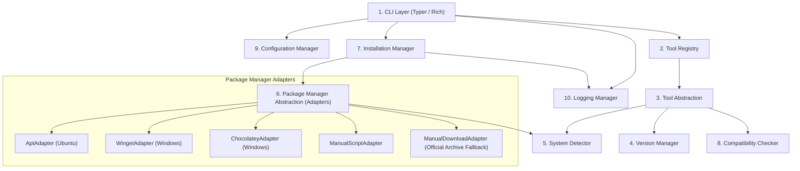
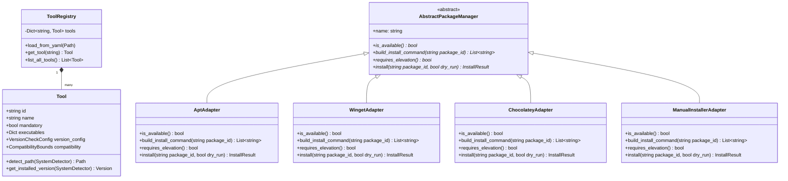
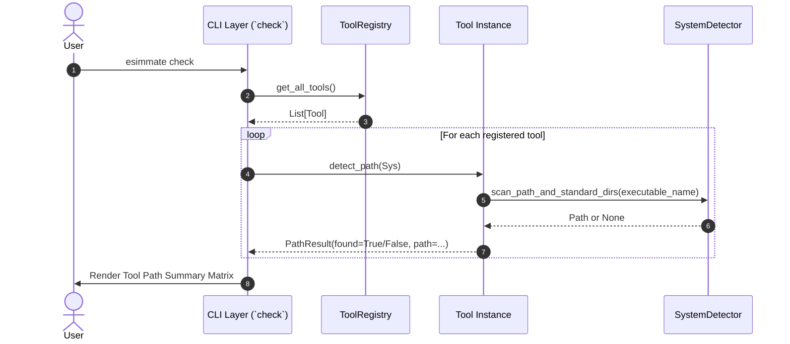
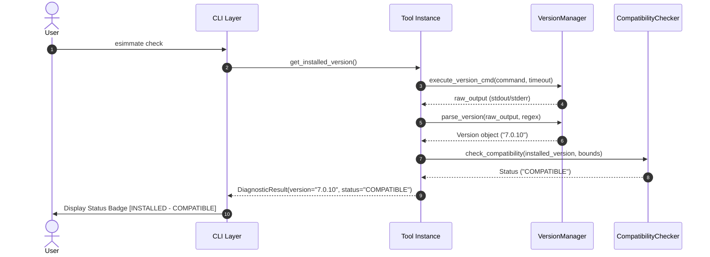
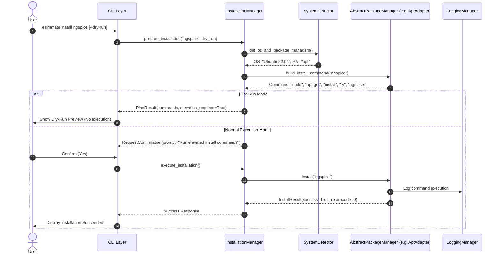
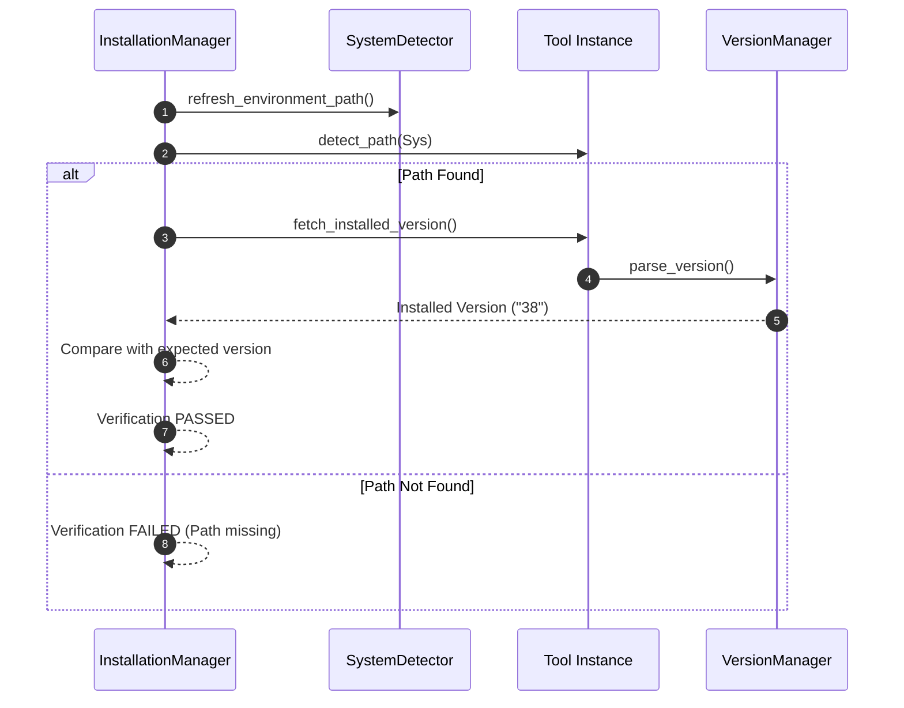
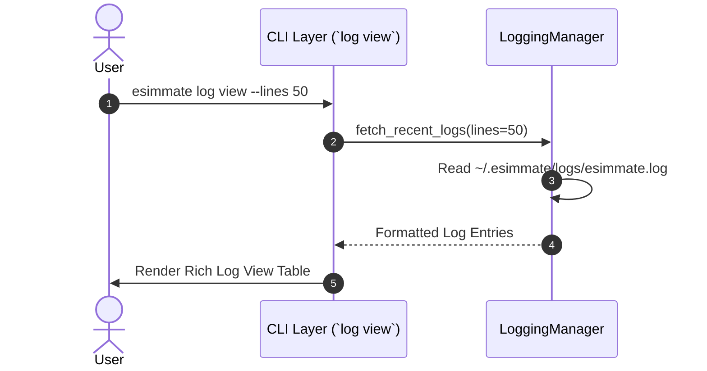

# eSimMate System Architecture Specification

**Project:** eSimMate — Automated Tool & Dependency Manager for eSim  
**Context:** FOSSEE eSim Semester Long Internship (Autumn 2026) — Screening Task 5  
**Document Version:** 1.0.0  
**Status:** Architecture Baseline Document  

---

## 1. Executive Summary & Design Goals

**eSimMate** is designed as a modular, extensible, platform-agnostic, and safe tool and dependency manager for eSim. It decouples core business logic (system detection, version comparison, package manager execution) from the presentation layer (CLI or future PyQt6 GUI).

### Core Architectural Principles:
1. **SOLID Design Principles:** High cohesion, low coupling, single-responsibility modules, and interface segregation.
2. **Open-Closed Principle (Extensibility):** Core managers operate on abstract specifications. New tools can be added via simple YAML files without modifying core Python code. New package managers can be added via the Adapter design pattern.
3. **Safety & Zero-Surprise Privilege Handling:** Installation execution is explicit, dry-run testable, and audited. Privileged commands are never executed implicitly or via dangerous shell string execution.
4. **Platform Isolation:** OS-specific logic (Windows registry/PATH vs. Linux `/usr/bin`) is abstracted behind platform adapters.

---

## 2. High-Level Subsystem Architecture

eSimMate comprises ten core subsystems:

---

## 3. Subsystem Breakdown & Component Specification

### 3.1 Subsystem 1: CLI Layer (`esimmate.cli`)
* **Responsibility:** User interaction, command parsing, terminal visual layout, confirmation prompts, and rendering tabular diagnostic reports.
* **Technology:** Built with `Typer` and `Rich`.
* **Key Commands:**
  * `esimmate check`: Triggers environment detection and compatibility status scan across all registered tools.
  * `esimmate list`: Displays configured tools, executable targets, and supported version bounds.
  * `esimmate install <tool>`: Initiates installation for specified tool (or `--all`). Supports `--dry-run` and `--yes`.
  * `esimmate config`: Views or updates user preferences and custom binary search paths.
  * `esimmate log`: Inspects persistent operation audit logs.

### 3.2 Subsystem 2: Tool Registry (`esimmate.core.registry`)
* **Responsibility:** Dynamically discovers, loads, and manages `Tool` objects from YAML definitions (`configs/tools.yaml` and optional custom user tool drop-ins at `~/.esimmate/tools.d/*.yaml`).
* **Extensibility:** To support a new external tool, users simply add a YAML file into `tools.d/`. The `ToolRegistry` parses the file and instantiates a standard `Tool` instance automatically—**zero core Python code modification required.**

### 3.3 Subsystem 3: Tool Abstraction (`esimmate.core.tool`)
* **Responsibility:** Encapsulates the domain model of an external EDA tool.
* **Attributes:** Tool ID, display name, category, mandatory flag, platform binary names, version check command arguments, extraction regex, package manager mapping, and default search paths.
* **Methods:** `detect_binary_path()`, `fetch_installed_version()`, `evaluate_compatibility()`.

### 3.4 Subsystem 4: Version Manager (`esimmate.core.version`)
* **Responsibility:** Handles version string extraction from subprocess `stdout`/`stderr` using tool-specific regular expressions and parses them into comparable `packaging.version.Version` objects.
* **Resilience:** Handles version format discrepancies (e.g., `ngspice-38`, `KiCad v7.0.10`, `GHDL 3.0.0`).

### 3.5 Subsystem 5: System Detector (`esimmate.core.system`)
* **Responsibility:** Queries host environment metadata:
  * Operating System (`Windows`, `Linux`)
  * OS Distribution & Version (`Ubuntu 22.04`, `Ubuntu 24.04`, `Windows 11`)
  * CPU Architecture (`x86_64`, `AMD64`, `arm64`)
  * System `$PATH` environment variable scanner
  * Standard installation directory inspector

### 3.6 Subsystem 6: Package Manager Abstraction & Adapters (`esimmate.managers.package_manager`)
* **Responsibility:** Abstract Base Class (`AbstractPackageManager`) isolating package installation commands behind a unified API (`install_package()`, `is_available()`, `build_command()`).
* **Design Pattern:** **Adapter Pattern**. Future package managers (e.g., `FlatpakAdapter`, `BrewAdapter`) can be added by implementing the base interface.
* **Adapters Included:**
  * `AptAdapter`: Handles `sudo apt-get install -y <pkg>` on Ubuntu/Debian.
  * `WingetAdapter`: Handles `winget install --id <id> --accept-source-agreements` on Windows.
  * `ChocolateyAdapter`: Handles `choco install <pkg> -y` on Windows.
  * `ManualInstallerAdapter`: Executes standalone installer scripts or binary installers safely.

### 3.7 Subsystem 7: Installation Manager (`esimmate.managers.installer`)
* **Responsibility:** Coordinates end-to-end tool installation workflows.
* **Features:**
  * Validates system detection and resolves appropriate package manager adapter.
  * Generates dry-run execution plans (`PlanResult`).
  * Prompts for privilege elevation confirmation (`sudo` or Windows Admin).
  * Executes commands using safe `subprocess.run(cmd_list)` calls with log redirection.
  * Performs post-installation verification to ensure the tool is functional and on `$PATH`.

### 3.8 Subsystem 8: Compatibility Checker (`esimmate.core.compatibility`)
* **Responsibility:** Compares an installed tool version against the compatibility bounds (`min_version`, `recommended_version`, `max_version`) in `tools.yaml`.
* **Statuses:**
  * `MISSING`: Binary not found.
  * `OUTDATED`: Installed version < `min_version`.
  * `COMPATIBLE`: `min_version` <= Installed version <= `max_version`.
  * `UNTESTED_NEWER`: Installed version > `max_version`.
  * `DETECTION_ERROR`: Execution timeout or regex mismatch.

### 3.9 Subsystem 9: Configuration Manager (`esimmate.config`)
* **Responsibility:** Manages application settings (`config.yaml`) and tool definition database (`tools.yaml`).
* **Precedence Resolution:** CLI flags > Environment Variables (`ESIMMATE_*`) > User Config (`~/.config/esimmate/config.yaml`) > Defaults.

### 3.10 Subsystem 10: Logging Manager (`esimmate.utils.logging`)
* **Responsibility:** Centralized logging routing:
  * **Console Handler:** Filtered Rich terminal output for real-time user feedback.
  * **File Handler:** Rotating structured persistent logs at `~/.esimmate/logs/esimmate.log`.

---

## 4. Class Design & Adapter Architecture

---

## 5. End-to-End Data Flow Diagrams

### 5.1 Workflow 1: Detect Tool
User runs `esimmate check` to discover binary locations across host OS.

---

### 5.2 Workflow 2: Check Version
User queries or checks tool versions and evaluates against compatibility bounds.

---

### 5.3 Workflow 3: Install Tool
User requests installation of missing tool (`esimmate install ngspice`).

---

### 5.4 Workflow 4: Verify Installation
Post-installation automated health verification step executed by InstallationManager.

---

### 5.5 Workflow 5: View Logs
User inspects execution history via `esimmate log view`.

---

## 6. Summary of Architectural Guarantees

1. **Zero Code Change for New Tools:** Adding a new tool is as simple as creating `~/.esimmate/tools.d/my_tool.yaml`.
2. **Adapter Flexibility:** Adding support for macOS `brew`, Linux `snap` or `flatpak` requires only introducing a new class inheriting from `AbstractPackageManager`.
3. **Safety First:** Commands are strictly parameterized lists executed through `subprocess.run()`. `shell=True` is forbidden.
4. **Independent Modules:** Every subsystem can be independently unit tested using mocks.

---
*End of Architecture Specification Document.*
