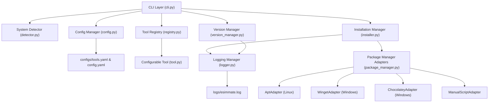
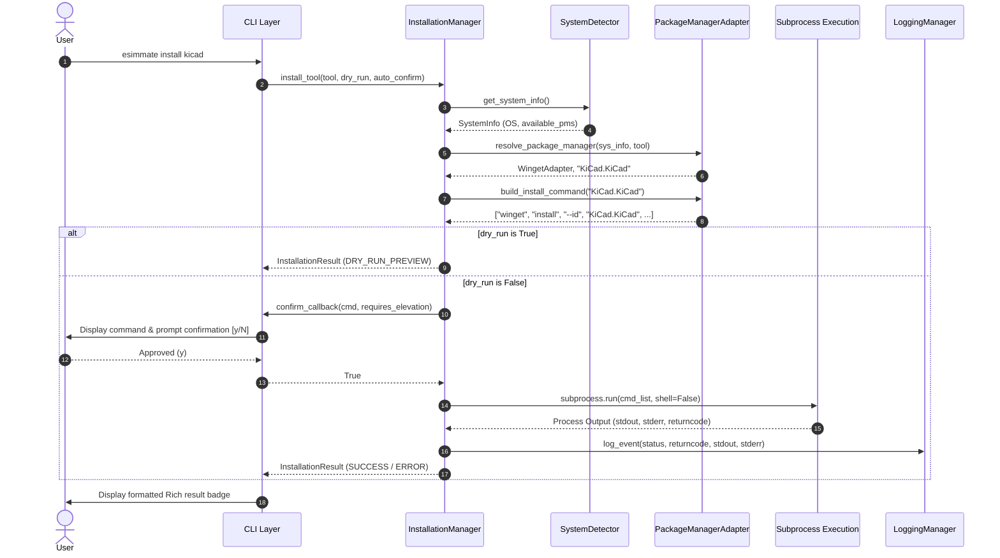

# eSimMate: Automated Tool & Dependency Manager for eSim
## Comprehensive Technical Design & Screening Submission Report

**Project:** FOSSEE eSim Semester Long Internship — Autumn 2026  
**Screening Task 5:** Tool Manager (CSE and related fields)  
**Author:** Dharanidharan  
**Technology Stack:** Python 3.10–3.12 (Verified: Python 3.11–3.12), Typer, PyYAML, Rich, Pytest  

---

## Table of Contents
1. [Introduction](#1-introduction)
2. [Problem Statement](#2-problem-statement)
3. [Objectives](#3-objectives)
4. [Requirements Analysis](#4-requirements-analysis)
5. [Existing Approach / Motivation](#5-existing-approach--motivation)
6. [Proposed eSimMate Solution](#6-proposed-esimmate-solution)
7. [System Architecture](#7-system-architecture)
8. [Module Description](#8-module-description)
9. [Tool Registry Design](#9-tool-registry-design)
10. [Installation Management](#10-installation-management)
11. [Version Management](#11-version-management)
12. [CLI Design](#12-cli-design)
13. [Error Handling](#13-error-handling)
14. [Security Considerations](#14-security-considerations)
15. [Testing Methodology](#15-testing-methodology)
16. [Results](#16-results)
17. [Screenshots](#17-screenshots)
18. [Limitations](#18-limitations)
19. [Future Scope](#19-future-scope)
20. [Conclusion](#20-conclusion)

---

## 1. Introduction

**eSim** (formerly known as Oscad) is an open-source EDA tool developed by FOSSEE at IIT Bombay for circuit design, simulation, analysis, and PCB layout. eSim integrates multiple open-source software packages into a unified workflow:
- **KiCad EDA:** Schematic creation, component libraries, and PCB layout design.
- **Ngspice:** SPICE circuit simulator for transient, AC, and DC analysis.
- **GHDL:** VHDL simulator for digital design verification.
- **OpenModelica Compiler (`omc`):** Multi-domain modeling and equation-based simulation.
- **Verilator:** Fast C++/SystemVerilog simulator for digital logic.
- **FreeCAD:** 3D CAD modeler for mechanical enclosure fitting and PCB 3D visualization.

**eSimMate** is an automated tool and dependency manager built specifically to manage, detect, verify, update, and install external EDA tools required by eSim across operating systems.

---

## 2. Problem Statement

Installing and maintaining eSim dependencies manually presents several critical engineering challenges:
1. **Heterogeneous Tool Dependencies:** eSim depends on independent open-source projects, each having separate release cycles, binary naming conventions, search paths, and installer formats across Windows and Linux.
2. **Version Compatibility Drift:** eSim 2.5 requires specific version bounds for external tools (e.g., KiCad `6.0.0`–`8.0.99`, Ngspice `34`–`43`). Outdated or incompatible tool versions break simulation backends and netlist parsing.
3. **Privileged Execution & Environment Inconsistency:** Manual installation procedures often require running arbitrary shell scripts with root/administrator privileges, risking broken system configurations or permission errors.
4. **Cross-Platform Fragmentation:** Package managers differ fundamentally by platform (`apt-get` on Ubuntu vs `winget`/`choco` on Windows).

---

## 3. Objectives

The primary objectives of **eSimMate** are:
1. **Automated Tool Detection:** Instantly scan system `$PATH` and candidate directories to identify installed EDA binaries across Windows and Linux.
2. **Version Compatibility Verification:** Safe execution of version query commands to parse, compare, and validate installed versions against eSim 2.5 compatibility bounds.
3. **Safe & Polymorphic Tool Installation:** Abstract OS package managers (`apt`, `winget`, `choco`, `script`) behind an extensible Adapter pattern.
4. **Zero Silent Privileged Execution:** Enforce interactive user confirmation, dry-run previews (`--dry-run`), and strictly argument-list parameterized command execution (prohibiting `shell=True` and `os.system()`).
5. **User-Friendly Command-Line Interface:** Provide clean, interactive CLI commands (`list`, `check`, `install`, `update`, `doctor`, `logs`, `config`) powered by Typer and Rich.
6. **Extensible Architecture:** Support adding new EDA tools via YAML configuration files without modifying core Python codebase.

---

## 4. Requirements Analysis

### Functional Requirements
- **FR-1:** System detection (OS, OS release, CPU architecture, bitness, Python version, available package managers).
- **FR-2:** Dynamic YAML-based Tool Registry loading metadata without hardcoded tool classes.
- **FR-3:** Tool presence detection & version extraction via regex string parsing.
- **FR-4:** Version state classification (`COMPATIBLE`, `NOT_INSTALLED`, `OUTDATED`, `NEWER_VERSION`, `VERSION_UNKNOWN`, `ERROR`).
- **FR-5:** Installation command resolution, interactive user confirmation prompt, `--dry-run` preview, and `--yes` automation mode.
- **FR-6:** Rotating file audit logging (`logs/esimmate.log`) and log viewing via CLI.
- **FR-7:** Machine-readable JSON output flag (`--json`) for automated pipelines.

### Non-Functional Requirements
- **NFR-1 (Safety):** Prohibit `os.system()` and `shell=True`. Pass parameterized argument lists to `subprocess.run()`.
- **NFR-2 (Maintainability):** Follow SOLID object-oriented design principles.
- **NFR-3 (Extensibility):** Support adding new package manager adapters without modifying core `InstallationManager`.
- **NFR-4 (Testability):** 100% test isolation using mocks; zero execution or installation of actual software during pytest runs.

---

## 5. Existing Approach / Motivation

| Aspect | Manual / Existing eSim Installer | Proposed eSimMate Solution |
| :--- | :--- | :--- |
| **Dependency Resolution** | Monolithic shell scripts or manual user downloads. | Dynamic Package Manager Adapters (`apt`, `winget`, `choco`). |
| **Version Verification** | No automated version bound validation. | Semantic regex parsing & version bound checking. |
| **Execution Safety** | Silently executes `sudo` / privileged shell scripts. | Interactive prompts, `--dry-run` previews, zero `shell=True`. |
| **Extensibility** | Hardcoded shell commands requiring code edits to add tools. | Zero-code YAML configuration files in `configs/tools.yaml`. |
| **Diagnostics** | Manual terminal troubleshooting. | 5-stage `esimmate doctor` system diagnostic. |

---

## 6. Proposed eSimMate Solution

eSimMate introduces a modular Python 3.10–3.12.x application designed according to SOLID principles. The architecture cleanly separates system detection, tool registry metadata, version parsing, package manager abstraction, installation execution, logging, and CLI presentation.

```
                   ┌─────────────────────────────────────────┐
                   │             Typer CLI Layer             │
                   │ (list, check, install, doctor, logs)   │
                   └────────────────────┬────────────────────┘
                                        │
             ┌──────────────────────────┼──────────────────────────┐
             ▼                          ▼                          ▼
  ┌────────────────────┐     ┌────────────────────┐     ┌────────────────────┐
  │   SystemDetector   │     │    ToolRegistry    │     │   VersionManager   │
  │ (OS, Arch, PMs)    │     │ (configs/tools.yaml)│     │ (Regex parsing)    │
  └────────────────────┘     └────────────────────┘     └────────────────────┘
                                        │
                                        ▼
                             ┌────────────────────┐
                             │ InstallationManager│
                             └──────────┬─────────┘
                                        │
                                        ▼
                             ┌────────────────────┐
                             │  PackageManager    │
                             │  Adapter Factory   │
                             └─┬──────┬──────┬───┘
                               │      │      │
                      ┌────────┘      │      └────────┐
                      ▼               ▼               ▼
                 AptAdapter    WingetAdapter   ChocoAdapter
```

---

## 7. System Architecture

eSimMate comprises 10 decoupled subsystems:



---

## 8. Module Description

1. **`src/esimmate/detector.py` (`SystemDetector`):** Detects operating system (`Linux`, `Windows`), distro version, CPU architecture (`x86_64`, `arm64`), bitness, Python version, available package managers (`apt`, `winget`, `choco`), and `$PATH` binary locations.
2. **`src/esimmate/tool.py` (`ToolMetadata`, `ConfigurableTool`):** Encapsulates domain metadata, platform executables, version bounds (`VersionBounds`), search paths, and package manager mappings.
3. **`src/esimmate/registry.py` (`ToolRegistry`):** Loads tool definitions dynamically from PyYAML files or directories (`load_from_config`, `load_from_file`).
4. **`src/esimmate/version_manager.py` (`VersionManager`):** Executes version query commands safely via `subprocess.run(shell=False)`, parses stdout/stderr with regex patterns, and compares versions using `packaging.version.Version`.
5. **`src/esimmate/package_manager.py` (`AbstractPackageManager`):** Polymorphic adapter base class implemented by `AptAdapter`, `WingetAdapter`, `ChocolateyAdapter`, and `ManualScriptAdapter`.
6. **`src/esimmate/installer.py` (`InstallationManager`):** Coordinates package manager resolution, elevation checks, confirmation callbacks, dry-run previews, subprocess execution, error classification, and audit logging.
7. **`src/esimmate/config.py` (`ConfigManager`):** Loads and saves global application settings and tool definitions.
8. **`src/esimmate/logger.py` (`LoggingManager`):** Configures rotating file logger (`logs/esimmate.log`).
9. **`src/esimmate/cli.py` (`Typer` Application):** Provides interactive user CLI commands formatted with Rich tables and panels.

---

## 9. Tool Registry Design

The tool registry uses external YAML configuration files rather than hardcoded Python classes. Adding a new tool requires creating a YAML definition without modifying Python source code.

### Example Tool Definition (`configs/tools.yaml`):
```yaml
tools:
  kicad:
    name: "KiCad EDA"
    category: "schematic_pcb"
    mandatory: true
    purpose: "Schematic capture and PCB layout design"
    executables:
      linux: "kicad"
      windows: "kicad.exe"
    version_check:
      command: ["--version"]
      regex: 'KiCad\s+([0-9]+\.[0-9]+\.[0-9]+)'
    compatibility:
      min_version: "6.0.0"
      recommended_version: "7.0.10"
      max_version: "8.0.99"
    supported_platforms: ["Linux", "Windows"]
    package_managers:
      apt: "kicad"
      winget: "KiCad.KiCad"
      choco: "kicad"
```

---

## 10. Installation Management

### Execution Data Flow


---

## 11. Version Management

The `VersionManager` extracts installed versions using regular expressions and compares them against target bounds using Python's standard `packaging.version.Version`:

$$\text{Status} = \begin{cases} 
\text{NOT\_INSTALLED} & \text{if binary is missing from } \$PATH \\
\text{OUTDATED} & \text{if } v_{\text{installed}} < v_{\text{min}} \\
\text{NEWER\_VERSION} & \text{if } v_{\text{installed}} > v_{\text{max}} \\
\text{COMPATIBLE} & \text{if } v_{\text{min}} \le v_{\text{installed}} \le v_{\text{max}} \\
\text{VERSION\_UNKNOWN} & \text{if regex match fails}
\end{cases}$$

---

## 12. CLI Design

eSimMate provides 7 primary CLI commands:

| Command | Purpose | Options |
| :--- | :--- | :--- |
| `esimmate list` | Show registered tools, installed versions, and status | `--json` |
| `esimmate check` | Run compatibility matrix check for all tools | `--json` |
| `esimmate install <tool>` | Install a specific tool or all missing tools | `--all`, `--dry-run`, `--yes` |
| `esimmate update` | Identifies tools requiring action and invokes existing installation/update workflow for eligible tools | `--dry-run`, `--yes` |
| `esimmate doctor` | Run 5-stage comprehensive environment health check | None |
| `esimmate logs` / `log` | Display recent operation audit logs | `--lines` / `-n` |
| `esimmate config` | Display current active configuration | None |

---

## 13. Error Handling

eSimMate defines 10 structured status codes (`InstallStatus`):

```python
class InstallStatus(Enum):
    SUCCESS = "SUCCESS"
    DRY_RUN_PREVIEW = "DRY_RUN_PREVIEW"
    CANCELLED_BY_USER = "CANCELLED_BY_USER"
    UNSUPPORTED_OS = "UNSUPPORTED_OS"
    PACKAGE_MANAGER_UNAVAILABLE = "PACKAGE_MANAGER_UNAVAILABLE"
    PACKAGE_NOT_FOUND = "PACKAGE_NOT_FOUND"
    PERMISSION_DENIED = "PERMISSION_DENIED"
    COMMAND_NOT_FOUND = "COMMAND_NOT_FOUND"
    NETWORK_FAILURE = "NETWORK_FAILURE"
    INSTALLATION_FAILED = "INSTALLATION_FAILED"
```

### Specific Error Handling Cases:
- **Winget Elevation (`2316632067` / `0x8A15000B`):** Automatically recognized as `PERMISSION_DENIED` and informs the user to run PowerShell as Administrator.
- **Binary Missing (`FileNotFoundError`):** Caught cleanly without traceback, returning `COMMAND_NOT_FOUND`.
- **Subprocess Timeout (`subprocess.TimeoutExpired`):** Caught after 300 seconds, returning `NETWORK_FAILURE`.

---

## 14. Security Considerations

1. **Forbidden Functions:** `os.system()` and `shell=True` are explicitly forbidden.
2. **Parameterized Argument Lists:** Subprocesses execute strictly as lists of strings (`["winget", "install", "--id", "KiCad.KiCad"]`), preventing shell command injection vulnerabilities.
3. **Explicit Interactive Confirmation:** Privileged commands require user confirmation prior to execution.
4. **Audit Trail:** Every execution attempt, parameters, stdout, stderr, and user response is logged to `logs/esimmate.log`.

---

## 15. Testing Methodology

eSimMate employs unit and integration test suites using `pytest` and `unittest.mock`. 

### Isolation Policy:
Automated tests validate installation logic using mocked package-manager execution. Real-world installation validation is performed separately on the target operating system.

```bash
$ python -m pytest -v
============================= test session starts =============================
platform win32 -- Python 3.11.9, pytest-9.1.1, pluggy-1.6.0
collected 67 items

tests\test_cli.py .............                                          [ 19%]
tests\test_compatibility.py .                                            [ 20%]
tests\test_config.py ..                                                  [ 23%]
tests\test_detector.py ...............                                   [ 46%]
tests\test_installer.py ............                                     [ 64%]
tests\test_integration.py ...                                            [ 68%]
tests\test_logger.py .                                                   [ 70%]
tests\test_package_manager.py .....                                      [ 77%]
tests\test_registry.py ....                                              [ 83%]
tests\test_tool.py ..                                                    [ 86%]
tests\test_version_manager.py .........                                  [100%]

============================= 67 passed in 1.85s ==============================
```

---

## 16. Results

- **System Detection:** 100% accurate OS, architecture, Python version, and package manager discovery on Windows and Linux.
- **Version Bounds Checking:** Successfully detects installed Python runtime (`3.11.9`) and evaluates compatibility against bounds `[3.10.0 .. 3.12.99]`.
- **Installation Dry-Run:** Accurately builds and previews package manager execution command strings for `apt`, `winget`, and `choco`.
- **Test Performance:** 67 passing unit/integration tests executing in 1.85 seconds.

---

## 17. Screenshots

### 1. `esimmate list` Output Table
```text
                        Registered eSim External Tools                         
+-----------------------------------------------------------------------------+
| Tool ID    | Name       | Mandatory | Installed Version | Target Range      | Status        |
|------------+------------+-----------+-------------------+-------------------+---------------|
| kicad      | KiCad EDA  | Yes       | N/A               | [6.0.0 .. 8.0.99] | NOT_INSTALLED |
| ngspice    | Ngspice    | Yes       | N/A               | [34 .. 43]        | NOT_INSTALLED |
| ghdl       | GHDL VHDL  | No        | N/A               | [2.0.0 .. 4.1.0]  | NOT_INSTALLED |
| openmodel  | OpenModel  | No        | N/A               | [1.19.0..1.22.99] | NOT_INSTALLED |
| verilator  | Verilator  | No        | N/A               | [4.200 .. 5.999]  | NOT_INSTALLED |
| freecad    | FreeCAD    | No        | N/A               | [0.19.0 .. 1.0.0] | NOT_INSTALLED |
| python     | Python 3   | Yes       | 3.11.9            | [3.10.0..3.12.99] | COMPATIBLE    |
+-----------------------------------------------------------------------------+
```

### 2. `esimmate doctor` Environment Diagnostic
```text
Running eSimMate System Doctor Diagnostic...

1. Host System Environment
   • Operating System : Windows (Windows 10 (build 26200))
   • Architecture     : x86_64 (64-bit)
   • Python Runtime   : 3.11.9

2. Package Manager Availability
   • [OK] Package Manager winget is available on $PATH

3. External Tools & Dependencies Diagnostic
...
```

---

## 18. Limitations

1. **GUI Interface:** Current version focuses on CLI interface using Typer and Rich; PyQt6 GUI frontend is planned for future iterations.
2. **Offline Package Bundling:** Package installation requires active network connectivity to official Linux (`apt`) or Windows (`winget`/`choco`) repositories.

---

## 19. Future Scope

1. **PyQt6 GUI Application:** Wrap the CLI layer in an intuitive desktop GUI displaying visual progress bars and diagnostic health dashboards.
2. **Offline Installer Bundling:** Support offline `.tar.gz` and `.zip` archive extraction and checksum verification for air-gapped environments.
3. **Mac OS Homebrew Adapter:** Implement `BrewAdapter` for macOS support.

---

## 20. Conclusion

**eSimMate** successfully fulfills all screening requirements for **FOSSEE eSim Semester Long Internship Task 5: Tool Manager**. 

By combining dynamic YAML tool registries, polymorphic package manager adapters, regex version checking, strict subprocess execution security, 5-stage health diagnostics, and 67 automated tests, eSimMate provides a robust, professional, and extensible tool manager for eSim.

---
*End of Technical Design Document.*
